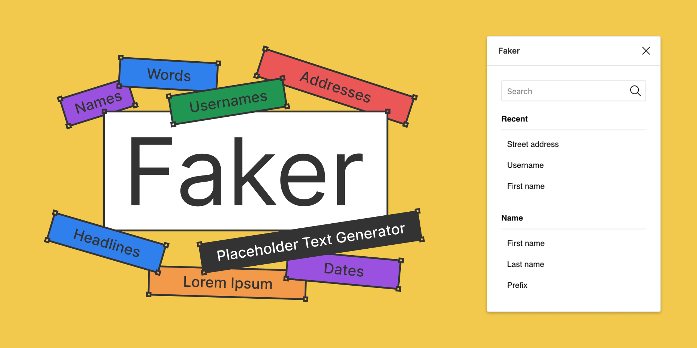

# Figma Faker Plugin



Quickly generate realistic placeholder text. Names, emails, URLs, headlines, and more.
Faker is built on top of [faker.js](https://github.com/Marak/faker.js).

## Data Included

- Names
- Addresses
- Companies
- Phone numbers
- Dates
- Lorem Ipsum
- Internet text
- Commerce text
- Finance text
- Random text
- Computer system text
- Hacker text

## Usage

- Install it from the [Figma plugin library](https://www.figma.com/community/plugin/833836762121994814)
- Select one or more objects
- Open the plugin and select a placeholder text option
- Any text nodes in the selection will be replaced with the Faker text of your choice

## Development

First clone this repository

```shell
git clone https://github.com/coryetzkorn/figma-faker
cd figma-faker
```

Install dependencies

```shell
npm install
```

Watch the plugin in development

```shell
npm run dev
```

Or build the plugin for production

```shell
npm run build
```

After that open a project in Figma Desktop, select _Plugins -> Development -> New Plugin_. Click `Choose a manifest.json` and find the `manifest.json` file in this plugin directory.

Done! Now access via _Plugins -> Development -> Faker_

## To-do

- [ ] Better / more human date formatting
- [ ] Add support for placeholder images

## Author

Cory Etzkorn ([Twitter](https://twitter.com/coryetzkorn))
